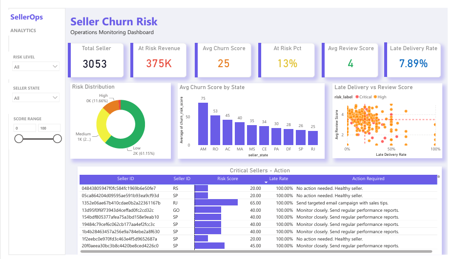

# Olist E-commerce: Seller Churn & Performance Analysis

## 🌟 Overview
This project analyzes seller performance and churn risk using the Olist e-commerce dataset. It combines SQL, Python, PostgreSQL, and Power BI to build business health indicators and support seller retention decisions.

Instead of reporting historical sales, the analysis focuses on uncovering early warning signals (operational issues, negative reviews, and revenue decline) that enable the Partner Support team to proactively retain valuable sellers before they become inactive.

---

## 📸 Dashboard


The dashboard is designed for Partner Support managers to quickly identify at-risk sellers and prioritize retention efforts based on financial exposure:
*   **KPIs:** Estimated GMV at Risk, number of high-risk sellers.
*   **Risk Distribution:** Classification of sellers into Critical, High, and Medium risk.
*   **Performance Correlation:** Relationship between logistics delays and customer review scores.
*   **Priority Action List:** Automatically generated action items (e.g., offer commission discount for critical sellers).

---

## ❓ Business Questions
The project addresses five core operational questions:
*   Which operational factors are the strongest indicators of seller churn?
*   Does delivery performance significantly affect customer satisfaction?
*   Which sellers should Partner Support prioritize this week?
*   How much GMV is currently exposed to churn risk?
*   Which geographic regions require logistics improvements?

---

## 📊 Dataset & Key Metrics

### Data Sources
The analysis integrates Olist's core tables: `Orders`, `Order Items`, `Customers`, `Products`, `Payments`, `Reviews`, and `Sellers` (processed from Kaggle API).

### Key Business Metrics
To evaluate seller health, the following metrics were generated using Advanced SQL:

| Metric | Business Meaning |
|--------|------------------|
| **Recency** | Number of days since the seller's last order (identifies inactivity) |
| **Late Delivery Rate** | Percentage of orders delivered past the estimated delivery date |
| **Revenue Trend** | Identifies consecutive months of declining revenue (Gaps & Islands problem) |
| **Recent Reviews** | Average review score in the last 90 days (current customer satisfaction) |
| **Historical Reviews** | Historical average review score used as a baseline for service quality |
| **Churn Risk Score** | Composite health score (0-100) based on operational thresholds |

---

## 💡 Key Findings & Business Impact

### Key Findings
1.  **Logistics is the primary driver of churn:** Delivery delays are the strongest indicator of a seller becoming inactive.
2.  **The 20% threshold:** Customer satisfaction (Review Score) drops rapidly once a seller's late delivery rate exceeds 20%.
3.  **Revenue warning:** Two consecutive months of revenue decline is the most reliable early warning signal of impending churn.
4.  **Geographic risk:** Sellers located in remote states (e.g., Amazonas - AM) face systemic logistics challenges that severely affect retention.

### Business Impact
*   **Proactive Retention:** Shifts support operations from reactive troubleshooting to early intervention.
*   **Optimized Resource Allocation:** Prioritizes high-value sellers based on their GMV exposure.
*   **Revenue Protection:** Identifies and targets approximately **$375,000 in Estimated GMV at Risk** for immediate recovery.

---

## 🏗️ Pipeline & Tech Stack
An automated ELT pipeline designed using the Medallion Architecture:

*   **Data Ingestion & Quality:** Python + `Great Expectations` (ephemeral data validation to filter invalid inputs).
*   **Storage & Transform:** PostgreSQL (Silver layer cleans and denormalizes tables into a single `orders_master`).
*   **Analytics & Scoring:** Advanced SQL (Gold layer calculates metrics, risk scores, and aggregates data in a Materialized View).
*   **Orchestration:** Python (`APScheduler` for daily runs + `Tenacity` retry logic + audit logging in `pipeline_runs`).
*   **Visualization:** Power BI.

---

## 🚀 Getting Started

### Prerequisites
Download your Kaggle API token (`kaggle.json`) from your Kaggle Account Settings and place it in the `.kaggle` directory:
*   Windows: `C:\Users\<Username>\.kaggle\kaggle.json`
*   Linux/macOS: `~/.kaggle/kaggle.json`

### Setup & Run
1.  **Environment Setup:**
    ```bash
    python -m venv .venv
    source .venv/bin/activate  # Windows: .venv\Scripts\activate
    pip install -r requirements.txt
    cp .env.example .env
    ```
2.  **Start Database:**
    ```bash
    docker-compose up -d
    ```
3.  **Run Pipeline:**
    ```bash
    python src/pipeline.py
    ```
